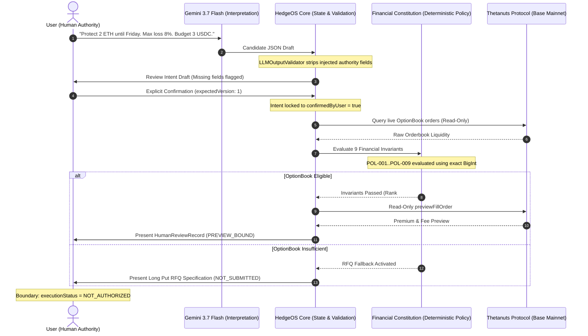

# HedgeOS Technical Architecture

## 1. Executive Summary
HedgeOS is a Risk Intent Compiler for Thetanuts Finance on Base Mainnet (Chain ID 8453). It bridges natural language risk management and on-chain decentralized options.

### Core Architectural Principle
> **AI interprets.**
> **Deterministic policy verifies.**
> **Financial authorization remains separate.**

---

## 2. High-Level System Architecture

```mermaid
graph TD
    User([User]) -->|Natural Language Prompt| API[Express API Server :3000]
    API -->|Prompt & Safe Length Check| LLMProvider[IntentProvider: Gemini 3.7 Flash]
    LLMProvider -->|Raw Model JSON| Validator[LLMOutputValidator: Zod Schema]
    Validator -->|Reject Unauthorized Authority Fields / Preserved Nulls| DraftRepo[(DevelopmentIntentRepository: Draft v1)]
    User -->|Explicit Approval + expectedVersion| ConfirmRoute[Confirmation Handler]
    ConfirmRoute -->|Confirmed Intent v1| ConfirmedRepo[(DevelopmentIntentRepository: Confirmed)]
    ConfirmedRoute --> Solver[ProtectionSolverEngine]
    
    subgraph Thetanuts Protocol Layer Base Mainnet 8453
        MarketService[ThetanutsMarketService]
        MarketService <--> SDKClient[@thetanuts-finance/thetanuts-client]
        SDKClient <--> OptionBook[(OptionBook Contract)]
        SDKClient <--> PriceFeeds[(Chainlink Price Feeds)]
        SDKClient <--> OptionFactory[(OptionFactory Contract)]
    end
    
    Solver <--> MarketService
    Solver --> Sizing[OptionSizingAdapter: 1:1 Contract Sizing]
    Solver --> Payoff[ExposurePayoffEngine: Protected Floor Model]
    Solver --> Constitution{FinancialConstitutionEngine: 9 Rules}
    
    Constitution -->|All Invariants Passed| ProposalBuilder[ActionProposalBuilder: OptionBook]
    Constitution -->|Liquidity / Strike Mismatch| RFQBuilder[RFQSpecificationBuilder: Long Put RFQ]
    
    ProposalBuilder --> SHA256[SHA-256 Cryptographic Proposal Digest]
    SHA256 --> SimService[ThetanutsSimulationService]
    SimService -->|eth_call previewFillOrder| ReviewRecord[HumanReviewService: PREVIEW_BOUND]
    ReviewRecord --> UIState([Client Review View: NOT_AUTHORIZED])
```

---

## 3. Trust Boundaries & Authority Separation

HedgeOS enforces 4 non-overlapping trust boundaries:



---

## 4. Component Responsibilities

### 4.1 AI Intent Layer (`src/providers/`, `src/services/LLMOutputValidator.ts`)
- **Model:** Gemini 3.7 Flash (`gemini-3.7-flash`).
- **Function:** Maps unstructured language to structured candidate intent parameters.
- **Constraints:**
  - Cannot confirm intents (`confirmedByUser` is strictly false).
  - Cannot choose arbitrary numbers or default horizons.
  - Output is strictly validated against Zod schemas; unauthorized keys are rejected.

### 4.2 State Management (`src/repositories/IntentRepository.ts`, `src/services/ApplicationStateMachine.ts`)
- **Storage:** In-memory repository (local hackathon prototype boundary).
- **Version Tracking:** Material edits increment `version` and invalidate previous confirmations.
- **Transition Guard:** `ApplicationStateMachine` rejects illegal shortcuts (e.g. `EMPTY -> REVIEW_READY`).

### 4.3 Financial Constitution (`src/services/FinancialConstitutionEngine.ts`)
- Authoritative single evaluator enforcing 9 strict invariants:
  1. `POL-001`: Total Cost $\le$ Max Budget Limit (exact integer base units).
  2. `POL-002`: Target Asset matches verified underlying evidence.
  3. `POL-003`: Protocol whitelist enforced (`THETANUTS`).
  4. `POL-004`: Strategy right is strictly `PUT`.
  5. `POL-005`: Intent is explicitly user-confirmed.
  6. `POL-006`: Expiry covers protection horizon ($T_{\text{expiry}} \ge T_{\text{horizon}}$).
  7. `POL-007`: Multi-leg permissions verified.
  8. `POL-008`: Maker liquidity satisfies exposure.
  9. `POL-009`: Payoff downside $\le$ Target Max Loss %.

### 4.4 Protocol Integration (`src/services/ThetanutsMarketService.ts`)
- **SDK:** `@thetanuts-finance/thetanuts-client` on Base Mainnet (8453).
- **Underlying Resolution:** Deterministic mapping via Chainlink price feeds in SDK `chainConfig`.
- **Preview & Sizing:** Dry-run `previewFillOrder` and maker collateral calculations.
- **Contract Resolution:** Dynamically resolves `OptionBook` and `OptionFactory` addresses.

### 4.5 RFQ Fallback Engine (`src/services/RFQSpecificationBuilder.ts`)
- Triggered automatically when OptionBook liquidity cannot fulfill the user's intent.
- Builds a custom Long Put RFQ specification targeting `OptionFactory`.
- Maintains honest unpriced status (`PENDING_RFQ_PRICING_REFINEMENT`) without fabricated numbers.

### 4.6 Simulation & Review Boundary (`src/services/HumanReviewService.ts`)
- Cryptographically binds proposals using SHA-256 digests over material parameters.
- Assigns binding status strictly as `PREVIEW_BOUND`.
- Discloses Time-of-Check to Time-of-Use (TOCTOU) risks.
- Locks execution status to `NOT_AUTHORIZED` with `ELIGIBLE_HUMAN_REQUIRED`.

---

## 5. Deployment Boundary & Scope
- **Hackathon Architecture:** Built as a local, single-demo-user hackathon prototype.
- **Execution Segregation:** Intentionally excludes wallet connect, private key management, signing, and on-chain broadcasting.
