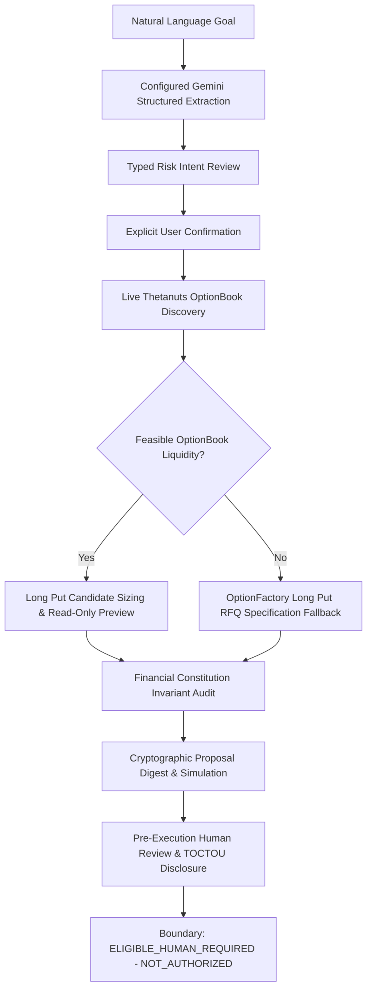

# HedgeOS Prompt 7: End-to-End Product UX & Judge Demo Experience

## 1. Executive Summary
HedgeOS is a Risk Intent Compiler for Thetanuts Finance on Base Mainnet (Chain ID 8453). It enables users to specify protection goals in plain language ("Protect 2 ETH until Friday with max 8% downside") and deterministically discovers, sizes, verifies, and reviews corresponding on-chain options without executing financial transactions.

Prompt 7 transforms the underlying technical engine into a polished, intuitive hackathon product experience tailored for both retail users and hackathon judges.

---

## 2. Mandatory Visual Design System
- **Restrained & Professional Aesthetic:** Clean neutral surfaces, subtle borders, restrained shadows, legible typography, and a single product accent color (`--accent: #0284c7` in Light mode, `#38bdf8` in Dark mode).
- **Anti-Gimmick Design:** Strictly zero purple/blue AI gradient headings, neon trading terminal glows, chatbot bubbles as main UI, sparkle/robot icons, or floating glassmorphism blobs.
- **Light & Dark Theme Engine:**
  - Semantic CSS variables (`--background`, `--surface`, `--surface-secondary`, `--surface-elevated`, `--text-primary`, `--text-secondary`, `--border`, `--accent`, `--success`, `--warning`, `--danger`).
  - Persistent user preference in `localStorage` with `prefers-color-scheme` support on first load.
  - Interactive theme switcher in the application header.
- **Responsive Layout:** Adaptive container (max width 1240px) scaling cleanly across mobile (320–480px), tablet (480–1024px), laptop (1024–1440px), and large desktop displays.

---

## 3. End-to-End User Flow

### Stage 1: Outcome-First Natural Language Input
- Large input textarea with 4 quick demo presets (OptionBook Success, Custom Horizon RFQ Fallback, Clarification Test, Security Boundary Test).
- Button: `Build my protection plan →` (Never "Trade", "Buy", or "Execute").

### Stage 2: Intent Review & Inline Clarification
- Structured summary card displaying Target Asset, Exposure Amount, Downside Target, Protection Budget, and Protection Horizon.
- Missing field banners with inline inputs (zero default hallucinations).
- Provenance tracking tags (`USER_EXPLICIT`, `AI_INFERRED`, `SYSTEM_DEFAULT`).

### Stage 3: Server-Owned Explicit Confirmation
- Dedicated confirmation gate at `POST /api/v1/intents/:id/confirm`.
- Locks parameters to a specific version (`Version #1`). Editing any parameter creates a new version and visibly resets confirmation state.

### Stage 4: Live Market Solving & Verification
- Real-time multi-step progress sequence (Base Mainnet OptionBook indexer, asset matching, verified 1:1 sizing, maker collateral liquidity check, read-only preview, and Financial Constitution audit).
- Displays backend-driven data source badge: `Live Base Mainnet (Chain ID 8453)` only when live read succeeds.

### Stage 5: Protection Result vs RFQ Fallback
- **OptionBook Match:** Displays Matched Protection Plan with strike floor, estimated cost, at-expiry floor value, and effective downside.
- **RFQ Fallback:** If existing liquidity is insufficient, presents dignified Custom Quote Plan with target strike derivation, requested contracts, pricing labeled `Waiting for MM Quotation`, and status `RFQ Specification Ready — Not Submitted`.
- **Put Spread Status:** Intentionally blocked pending verified lower-strike selection policy; Long Put RFQ fallback is active.

### Stage 6: Pre-Execution Review & Authorization Boundary
- Pre-execution review card showing verified parameters, `PREVIEW_BOUND` protocol status, and explicit TOCTOU limitation notice.
- Execution status: `NOT_AUTHORIZED`.
- Zero Connect Wallet, Execute, Sign, or Approve controls.

---

## 4. Advanced Judge Inspection View
A collapsible modal/drawer organizing technical proofs into 6 structured tabs:
1. **Architecture Flow:** Visual CSS flow diagram showing natural language to human authorization boundary.
2. **Financial Constitution:** Complete breakdown of policy checks (`POL-001` through `POL-009`) with live backend-evaluated statuses (`PASS`, `FAIL`, `NOT_EVALUATED`).
3. **At-Expiry Payoff Model:** Interactive scenario table comparing spot scenarios, portfolio floor value, net PnL, and effective downside.
4. **Proposal & Simulation Digest:** SHA-256 proposal digest, bound quote ID, protocol addresses, and simulation verification checks.
5. **Track Compliance Proof:** Concrete evidence for Track 1 (Thetanuts Finance SDK/Base) and Track 2 (AI × Options Intent Compiler).
6. **Sanitized Technical Evidence:** Full intent provenance, underlying resolution details, and selected inspectable protocol parameters.

---

## 5. Security & Read-Only Invariants
1. **Zero Private Keys:** No private keys or funded signers are configured.
2. **Zero Wallet Connections:** No wallet connection SDKs or transaction broadcasters exist in UI.
3. **Zero Token Approvals / On-Chain Writes:** All protocol interactions use read-only indexers and `previewFillOrder` simulation.
4. **Execution Authority Boundary:** Proposals remain strictly `UNAUTHORIZED` and RFQs remain `SPECIFICATION_ONLY_NOT_SUBMITTED`.
